# CPSC 233 - Tutorial 2 

## Goals for this tutorial
* Using the debugger to understand our programs
* conditionals
  * boolean expressions
  * if
  * if, else
  * if, else if
  * if, else if, else
  * logical operators
  * ternary operator
  * switch
  * break and default
  
* functions
  * function signature
  * function body
  * function parameters
  * function return types
  * function overloading
  
* loops
  * while loop
  * do while loop
  * for loop
  * for each loop
  * break and continue
  
* basic primitive arrays
  * 1 dimensional arrays
  * index access, modification, removal
  * out of bounds exception and null pointer exception
  * 2 dimensional array

## Conditionals

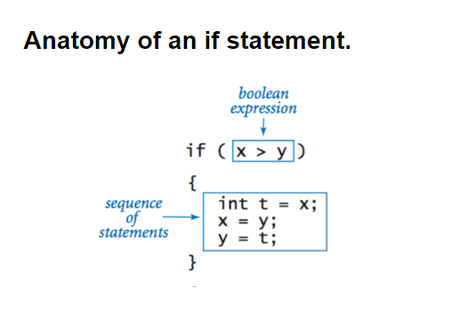
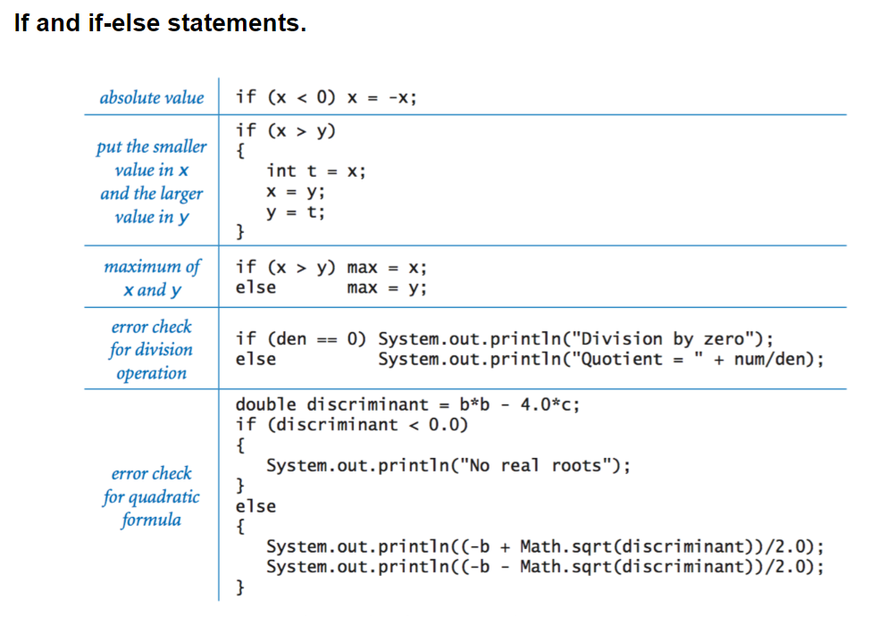
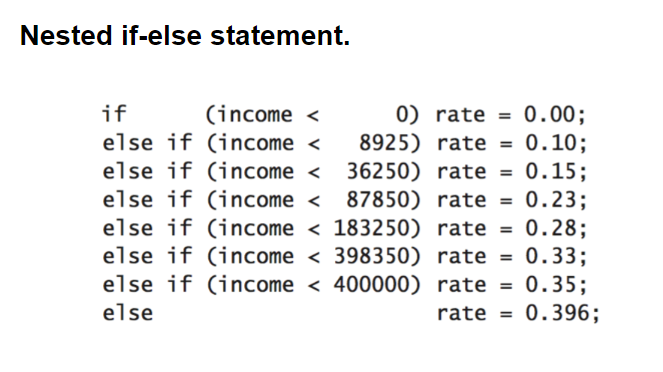

## functions
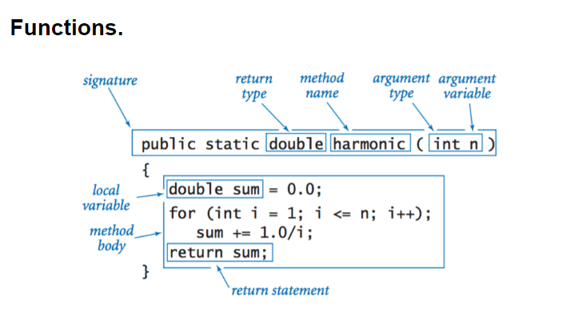
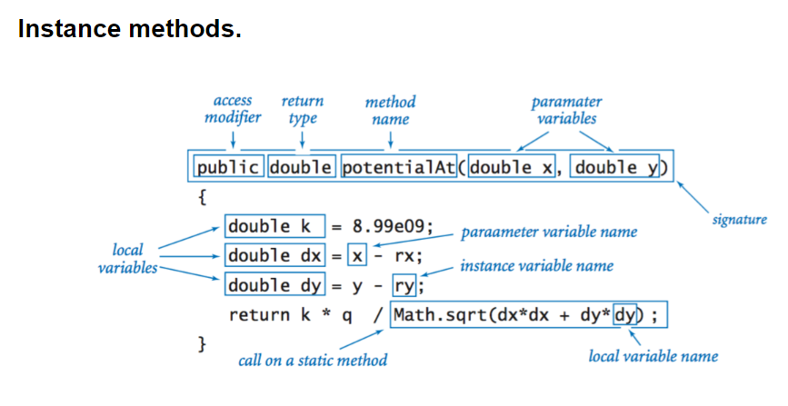
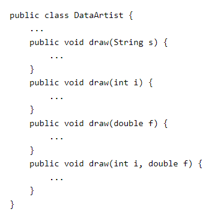
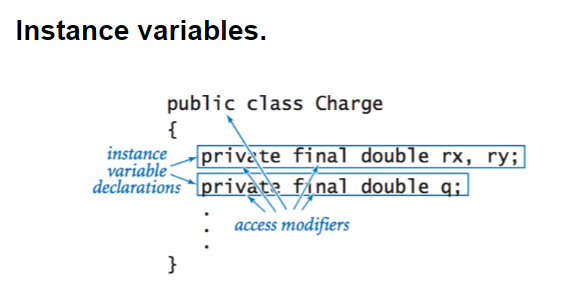
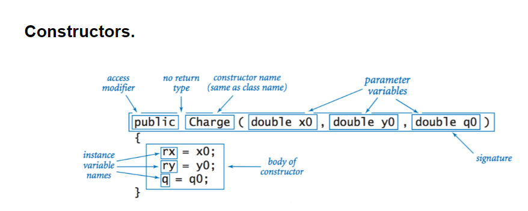
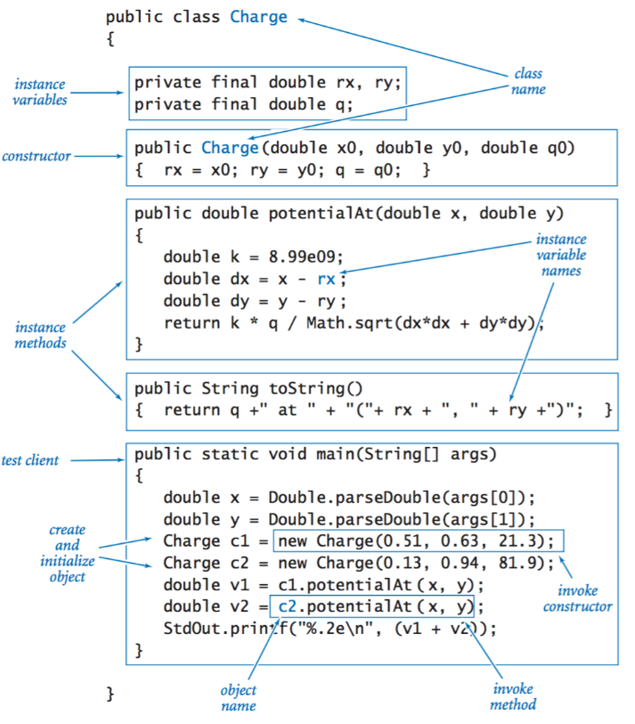

## loops
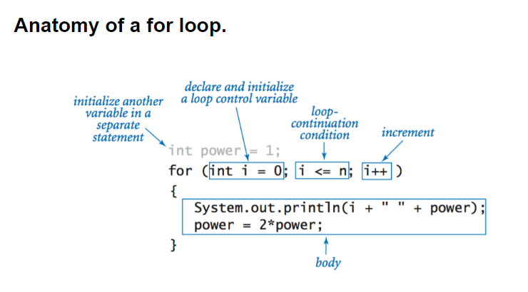
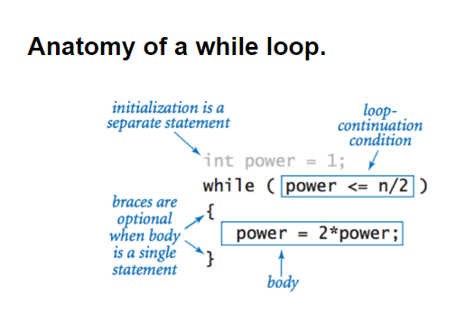
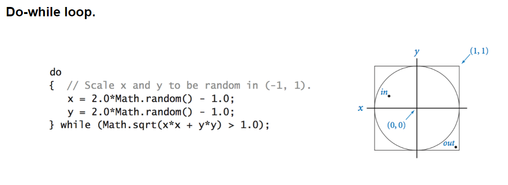

## arrays
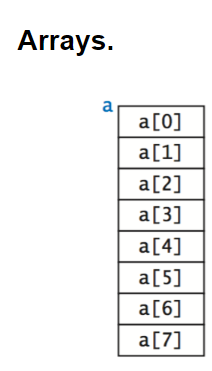
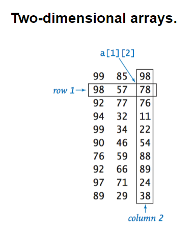